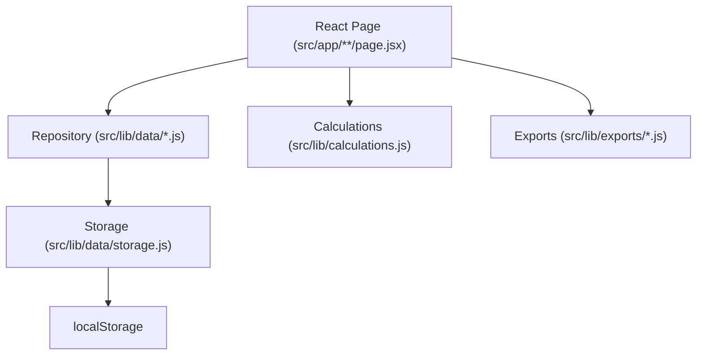
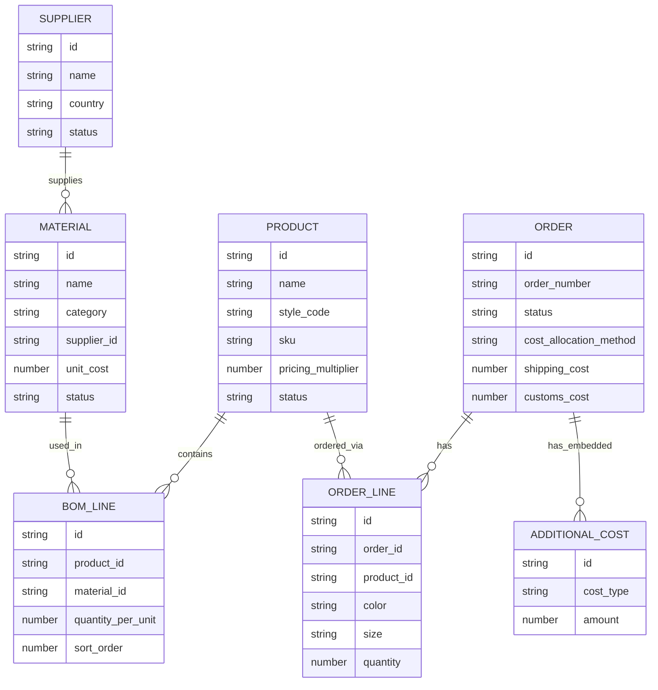

# PLACEBO PLM — Developer Guide

This document explains how the application works, how data flows through it, how to modify it, and how to debug it. Read this before diving into individual source files.

---

## Table of Contents

1. [System Overview](#1-system-overview)
2. [Architecture](#2-architecture)
3. [Application Flow](#3-application-flow)
4. [Dashboard](#4-dashboard)
5. [Products](#5-products)
6. [Bill of Materials (BOM)](#6-bill-of-materials-bom)
7. [Materials](#7-materials)
8. [Suppliers](#8-suppliers)
9. [Orders](#9-orders)
10. [Required Materials](#10-required-materials)
11. [Supplier Summary](#11-supplier-summary)
12. [Cost Breakdown](#12-cost-breakdown)
13. [Exports](#13-exports)
14. [Data Model](#14-data-model)
15. [Data Flow Examples](#15-data-flow-examples)
16. [How to Modify the System](#16-how-to-modify-the-system)
17. [Data Storage](#17-data-storage)
18. [Future Supabase Migration](#18-future-supabase-migration)
19. [Error Handling and Validation](#19-error-handling-and-validation)
20. [Debugging Guide](#20-debugging-guide)
21. [Development Conventions](#21-development-conventions)

---

## 1. System Overview

PLACEBO PLM is used by a small fashion label production team. The primary users are a product manager and production coordinator who need to:

- Know what every product is made of and what it costs per unit.
- Know what materials to order for a given production run.
- Know which supplier to order each material from and for how much.
- Export a complete cost package to share with factories and finance.

### Entity relationship (simplified)

```
Supplier
    |
    | (supplies one or more)
    v
Material  <----  BOMLine  ---->  Product
                                    |
                                    | (ordered via)
                                    v
                                OrderLine
                                    |
                                    | (belongs to)
                                    v
                                  Order
```

### Many-to-many realities

- A **Material** belongs to one Supplier (or none).
- A **Product** can use many Materials — each BOMLine links one Product to one Material with a `quantity_per_unit`.
- The same Material can appear in many Products' BOMs.
- An **Order** contains many OrderLines. Each OrderLine references one Product, one color, one size, and a quantity.
- The same Product can appear multiple times in one Order (different colors or sizes become separate OrderLines).

---

## 2. Architecture

### UI Layer

Next.js App Router pages (`src/app/**/*.jsx`) and shared components (`src/components/*.jsx`). All pages are Client Components (`'use client'`). They hold state with `useState`, load data in `useEffect`, call repository functions, and render JSX.

There is no server-side data fetching. Next.js is used purely for routing and build tooling.

### Data Access Layer (Repositories)

```
React Page
    |
    v
Repository  (src/lib/data/products.js, materials.js, etc.)
    |
    v
Storage Layer  (src/lib/data/storage.js)
    |
    v
localStorage
```

Each entity has its own repository module that exposes a plain object with `getAll`, `getById`, `create`, `update`, `remove`, and entity-specific methods. Repositories call only `getItems(key)` and `setItems(key, data)` from `storage.js` — they never access `localStorage` directly.

This is the intended Supabase migration boundary. See [Section 18](#18-future-supabase-migration).

### Business Logic Layer

All calculations live in `src/lib/calculations.js` as pure functions. They receive plain data arrays and return computed results. They have no side effects and no localStorage access. This makes them fully unit-testable and easy to reason about.

### Export Layer

`src/lib/exports/excel.js` and `src/lib/exports/pdf.js` each export one function that receives pre-computed data (order, orderLines, requiredMaterials, supplierSummary, costSummary) and generates a file download. The Order Detail page computes everything first and passes the results in.

### Mermaid diagram



---

## 3. Application Flow

What happens when a user opens the app for the first time:

1. **Next.js loads `src/app/layout.jsx`** — the root layout. It renders the `<DemoInit />` component and the `<Nav />` sidebar around all page content.

2. **`DemoInit` runs** (`src/components/demo-init.jsx`) — a client component that calls `initializeDemoData()` inside a `useEffect` on mount. This is a one-time operation guarded by the `plm_initialized_v3` localStorage key.

3. **`initializeDemoData()`** (`src/lib/demo-init.js`) — checks for the sentinel key. If absent, it writes all six demo data arrays to localStorage using `setItems()` and then sets the sentinel. On subsequent page loads this function returns immediately.

4. **The page component mounts** (e.g., `DashboardPage` in `src/app/page.jsx`). Its `useEffect` calls repository methods (`productRepository.getAll()`, etc.) to load data from localStorage.

5. **State is set** and React re-renders the component with the loaded data.

6. **User interactions** (creating records, editing, deleting) call repository `create`, `update`, or `remove` methods, then call the local `load()` function to re-read from localStorage and update state.

---

## 4. Dashboard

**Route:** `/`
**File:** `src/app/page.jsx`

The Dashboard loads all six entity collections on mount and computes:

- **Active Products** — products where `status === 'active'`.
- **Active Orders** — orders where status is not `completed` or `cancelled`.
- **Total Units** — sum of all order line quantities across every order.
- **Materials / Suppliers** — count of records with `status === 'active'`.
- **Approaching Deadlines** — `getApproachingOrders(orders, 60)` from `src/lib/calculations.js`, which filters non-completed/non-cancelled orders with a `target_date` within 60 days of today.
- **Recent Orders** — all orders sorted descending by `created_at`, first 5 shown.
- **Products Missing BOM** — active products that have zero BOM lines.

All data is read-only on the Dashboard. Users navigate to individual record pages by clicking rows or links.

---

## 5. Products

### Products List

**Route:** `/products`
**File:** `src/app/products/page.jsx`

Loads all products via `productRepository.getAll()`. Provides three client-side filters: free-text search (name, style code, SKU), category, and status. Default status filter is `active`.

Clicking a row navigates to `/products/[id]`.

The **+ Add Product** button opens a modal. On save, `uuidv4()` generates the ID, `productRepository.create()` writes to localStorage, and the router pushes to the new product's detail page.

**Validation on create:**
- Name is required.
- Style code is required and must be unique across all existing products.
- SKU is required and must be unique across all existing products.

### Product Detail

**Route:** `/products/[id]`
**File:** `src/app/products/[id]/page.jsx`

The detail page has four tabs:

| Tab | What it shows |
|---|---|
| Overview | Product fields (name, style code, SKU, season, category, selling price, colors, sizes, description, notes) |
| Bill of Materials | BOM lines grouped by material category group |
| Costing | Unit cost breakdown and RSP calculator |
| Orders | Orders that include this product |

**Status change:** A `<Select>` in the page header calls `productRepository.update(id, { status })` immediately on change — no save button required.

**Editing:** The Overview tab toggles between read and edit mode. In edit mode, the form writes back with `productRepository.update(id, { ...form })`.

**Pricing multiplier:** The Costing tab has an inline input for the multiplier. Changing it immediately calls `productRepository.update(id, { pricing_multiplier: num })` and re-renders the RSP.

**Colors and sizes:** These are arrays (`product.colors`, `product.sizes`). They are set on the product record and used by order line forms to populate dropdowns. They are currently set directly on the product object — there is no separate UI for managing them in the create modal (they start as empty arrays and must be edited via the edit form on the detail page).

**Product statuses:** `active`, `archived`, `draft`.

**Deleting a product:** The delete confirmation modal triggers `handleDelete()`, which:
1. Calls `bomRepository.removeByProduct(id)` to remove all BOM lines for this product.
2. Removes the product's order lines from all orders using `orderLineRepository.saveMany()`.
3. Calls `productRepository.remove(id)`.
4. Navigates to `/products`.

---

## 6. Bill of Materials (BOM)

A BOM is the complete list of materials — and their quantities per unit — needed to produce one unit of a product.

### BOMLine

Each BOMLine record links one Product to one Material:

```
BOMLine {
  id                string   UUID
  product_id        string   References Product
  material_id       string   References Material
  quantity_per_unit number   How many units of the material per product unit
  notes             string   Optional notes
  sort_order        number   Display ordering (set to bomLines.length + 1 on create)
}
```

### Example

```
Product: LOKE BOXY PUFFER

BOM Lines:
  ARIZONA 7999 (fabric)      4 m   × €5.80  = €23.20
  TNT SCRIM BLACK (fabric)   3 m   × €0.45  = €1.35
  200 ZERO DOWN (filling)    3 kg  × €6.30  = €18.90
  100 ZERO DOWN (filling)    3 kg  × €3.45  = €10.35
  VISLON #3 (zipper)         2 pcs × €3.00  = €6.00
  ... (more trims and hardware)
  Sewing / Labor             1     × €120   = €120.00
                                     Total  = €198.70
```

The total unit cost of €198.70 is computed by `calculateBOMCost()` in `src/lib/calculations.js`.

### BOM UI

The BOM tab on the Product Detail page (`src/app/products/[id]/page.jsx`) shows lines grouped by `MATERIAL_CATEGORY_GROUPS` from `src/lib/constants.js`:

- Fabrics (fabric, filling)
- Soft Trims (soft_trim)
- Trims (zipper, label, hardware, branding)
- Packaging (packaging)
- Labor (labor)
- Additional Costs (other)

Adding a BOM line: user selects a material from a grouped `<select>` (only `status === 'active'` materials appear), enters a quantity, and optionally a note. `bomRepository.create()` writes the new line.

Editing: `bomRepository.update(id, { material_id, quantity_per_unit, notes })`.

Deleting: `bomRepository.remove(lineId)` — no cascade; only the BOM line is removed.

---

## 7. Materials

### Materials List

**Route:** `/materials`
**File:** `src/app/materials/page.jsx`

Materials can be displayed **Grouped** (by `MATERIAL_CATEGORY_GROUPS`) or **Flat** (a single table). Grouped view is the default and is only shown when no search or category filter is active.

**Material statuses:** `active`, `archived`. Archived materials are hidden from BOM selectors.

**Validation on create:** Name and category are required. No uniqueness check on name.

### Material Categories

Defined in `src/lib/constants.js` as `MATERIAL_CATEGORIES`:

| Category | Description |
|---|---|
| `fabric` | Shell fabrics, linings |
| `filling` | Down, synthetic fill |
| `soft_trim` | Elastic, ribbon, soft labels |
| `zipper` | All zipper types |
| `label` | Woven labels, care labels |
| `hardware` | Buckles, snaps, cord locks |
| `branding` | Patches, embroidery |
| `packaging` | Polybags, hangtags |
| `labor` | Sewing, assembly, finishing |
| `other` | Anything else |

`labor` is the only category treated specially by the calculation engine — it is excluded from logistics cost allocation.

### Material Detail

**Route:** `/materials/[id]`
**File:** `src/app/materials/[id]/page.jsx`

Shows:
- Material fields (editable)
- **Required in Active Orders** — runs `calculateRequiredMaterials()` across all active order lines to find how much of this specific material is currently needed.
- **Used In Products** — BOM lines referencing this material, showing the product name and `quantity_per_unit`.

**Archive:** Toggles `status` between `active` and `archived`. Archived materials stay in the BOM but are hidden from BOM selectors for new additions.

**Duplicate:** Creates a copy with `name + " (Copy)"` and `internal_code + "-COPY"` via `materialRepository.create()`. Navigates to the new material.

**Delete:** Removes all BOM lines referencing this material first, then removes the material record.

**Warnings:** The page shows amber warning banners if:
- `supplier_id` is null (no supplier assigned)
- `unit_cost` is null (costing will be incomplete)

---

## 8. Suppliers

### Suppliers List

**Route:** `/suppliers`
**File:** `src/app/suppliers/page.jsx`

Simple list with text search and status filter. **Validation on create:** Name is required.

### Supplier Detail

**Route:** `/suppliers/[id]`
**File:** `src/app/suppliers/[id]/page.jsx`

Shows:
- Supplier contact fields (editable)
- **Active Order Value** — the sum of `estimated_cost` for all materials from this supplier that appear in currently active orders. Computed by running `calculateRequiredMaterials()` for each active order and summing the relevant entries.
- **Materials Supplied** — all material records where `supplier_id === id`.
- **Products Using This Supplier** — products whose BOM references at least one material from this supplier (via BOM lines).

**Archive/Restore:** Toggles `status` between `active` and `archived`.

**Delete:** Only removes the supplier record. Materials that reference this supplier retain their `supplier_id` (the material detail page will show a "No supplier" warning). This is intentional — deleting a supplier does not cascade to materials.

---

## 9. Orders

### Orders List

**Route:** `/orders`
**File:** `src/app/orders/page.jsx`

Shows all orders sorted newest-first. Each row shows unique product count and total units (derived from order lines). Filterable by status.

### New Order

**Route:** `/orders/new`
**File:** `src/app/orders/new/page.jsx`

A two-column layout: order details form on the left, product search panel on the right.

Users click products in the search panel to add them as order lines. Each line starts with `color` and `size` pre-filled from the product's `colors[0]` / `sizes[0]` arrays (or blank if the arrays are empty).

**Validation on create:**
- Order number is required and must be unique (`orderRepository.orderNumberExists()`).
- Order name is required.
- Confirming an order requires at least one product line.
- Duplicate product + color + size combinations within the same order are not allowed.

Clicking **Save as Draft** creates the order with `status: 'draft'`. Clicking **Confirm Order** creates it with `status: 'confirmed'`.

Cost fields are initialized to `null` on create:
```
shipping_cost: null
shipping_cost_type: 'fixed'
customs_cost: null
customs_type: 'fixed'
cost_allocation_method: 'by_value'
additional_costs: []
```

### Order Detail

**Route:** `/orders/[id]`
**File:** `src/app/orders/[id]/page.jsx`

The most complex page in the application. It has four tabs and a costs modal.

#### Order Lifecycle

```
draft  ->  confirmed  ->  in_progress  ->  completed
                                    \
                               cancelled
```

Status is changed via a `<Select>` in the page header. Any transition is allowed (no enforced order).

#### Four Tabs

**Products tab** — lists all order lines with per-line unit cost and RSP. Users can add, edit, or remove lines. Adding/editing validates the product + color + size uniqueness constraint.

**Required Materials tab** — shows the output of `calculateRequiredMaterials()` followed by `applyLandedCostAllocation()`. Each row shows material name, supplier, total quantity, unit cost, estimated material cost, allocated logistics costs, and total landed cost.

**Supplier Summary tab** — shows the output of `buildSupplierSummary()`. Each supplier gets a card with all their materials, subtotals, and total landed cost.

**Cost Breakdown tab** — shows `calculateOrderCostSummary()` on the left and a per-product cost table on the right. The per-product costs are computed inline by `getProductLineCosts()` inside the page component.

#### Costs Modal

Opened by the **Costs** button. Allows configuring:
- **Shipping:** fixed amount or per-unit rate.
- **Customs:** fixed amount or percentage of (materials + shipping).
- **Additional Costs:** a list of named costs, each fixed / per-unit / percentage.
- **Cost Allocation Method:** `by_value`, `by_quantity`, or `equally`.

Saving calls `orderRepository.update(id, { shipping_cost, shipping_cost_type, customs_cost, customs_type, cost_allocation_method, additional_costs })`.

#### Exports

The **Export Excel** and **Export PDF** buttons in the page header call `exportOrderToExcel()` and `exportOrderToPDF()` respectively. They receive already-computed data (no re-computation inside the export functions).

---

## 10. Required Materials

The core aggregation function is `calculateRequiredMaterials()` in `src/lib/calculations.js`.

It takes:
- `orderLines` — the lines of one or more orders
- `products` — all product records
- `bomLines` — all BOM line records
- `materials` — all material records
- `suppliers` — all supplier records

For each order line it looks up the product's BOM, multiplies each BOM line's `quantity_per_unit` by the order line's `quantity`, and accumulates the result per material ID.

```
Example:

Order has two lines:
  LOKE BOXY PUFFER  × 22 units
  ULLER MIDI PUFFER × 2 units

LOKE BOM: ARIZONA 7999 fabric = 4 m/unit
ULLER BOM: ARIZONA 7999 fabric = 5 m/unit

Result:
  ARIZONA 7999:  (4 × 22) + (5 × 2) = 88 + 10 = 98 m
```

The return value is an array of `RequiredMaterial` objects:

```javascript
{
  material: { ...materialRecord, supplier: supplierRecord | undefined },
  total_quantity: number,
  products: [{ product, quantity, bom_quantity }, ...],
  unit_cost: number | null,
  estimated_cost: number | null,   // unit_cost × total_quantity
  warnings: string[]               // e.g. ['No supplier assigned', 'No unit cost']
}
```

---

## 11. Supplier Summary

`buildSupplierSummary(requiredMaterials, shippingDestination)` in `src/lib/calculations.js` takes the output of `calculateRequiredMaterials()` (after `applyLandedCostAllocation()` has been applied) and groups entries by `material.supplier.id`.

Materials with no supplier are grouped under a `null` supplier key displayed as "No Supplier".

Each group totals `estimated_cost`, `allocated_shipping`, `allocated_customs`, `allocated_additional`, and `total_landed_cost` across its materials.

---

## 12. Cost Breakdown

The cost breakdown on the Order Detail page assembles costs from multiple sources:

1. `calculateRequiredMaterials()` produces per-material base costs.
2. `applyLandedCostAllocation()` enriches each material with `allocated_shipping`, `allocated_customs`, `allocated_additional`, and `total_landed_cost`.
3. `calculateOrderCostSummary()` sums everything into order-level totals and computes `average_cost_per_unit`.
4. `getProductLineCosts()` (defined inside the Order Detail page component) attributes costs back to individual order lines by tracing each material's allocation fraction for each product.

See [BUSINESS_LOGIC.md](BUSINESS_LOGIC.md) for the exact formulas.

---

## 13. Exports

### Excel Export

**File:** `src/lib/exports/excel.js`
**Function:** `exportOrderToExcel(data)`

Receives: `{ order, orderLines, products, requiredMaterials, supplierSummary, costSummary, pricingMultiplier }`

Produces a five-sheet `.xlsx` workbook using the `xlsx` library:

| Sheet | Contents |
|---|---|
| Order Summary | Order metadata and cost totals |
| Products | One row per order line with per-unit cost breakdown |
| Required Materials | Full required materials list with allocated costs |
| Supplier Summary | One row per supplier with material names, quantities, and totals |
| Cost Breakdown | Category totals, average unit cost, RSP, per-product RSP |

The file is named `{order.order_number}-export.xlsx` and triggers a browser download via `XLSX.writeFile()`.

### PDF Export

**File:** `src/lib/exports/pdf.js`
**Function:** `exportOrderToPDF(data)`

Receives: same shape as `exportOrderToExcel`.

Produces an A4 portrait PDF using `jsPDF` and `jspdf-autotable`:

1. Header with PLACEBO branding and order number.
2. Order details table (status, dates, factory, destination).
3. Products table (per-line costs, labor, unit cost, RSP).
4. Required materials table (qty, unit cost, mat cost, shipping, landed cost).
5. Cost summary table (category totals, average cost/unit, avg RSP).

File is named `{order.order_number}-export.pdf` and downloaded via `doc.save()`.

---

## 14. Data Model

### Supplier

```javascript
{
  id: string,                   // UUID
  name: string,                 // Required
  country: string,
  contact_person: string,
  email: string,
  phone: string,
  website: string,
  currency: string,             // Default 'EUR'
  lead_time: number | null,     // Days
  payment_terms: string,
  minimum_order_quantity: number | null,
  notes: string,
  status: 'active' | 'archived',
  created_at: string,           // ISO date string
  updated_at: string,
}
```

### Material

```javascript
{
  id: string,
  name: string,                 // Required
  internal_code: string,
  category: string,             // Required. One of MATERIAL_CATEGORIES
  description: string,
  supplier_id: string | null,   // References Supplier.id
  supplier_item_code: string,
  unit_of_measurement: string,  // e.g. 'm', 'kg', 'pcs'
  unit_cost: number | null,
  currency: string,             // Default 'EUR'
  lead_time: number | null,     // Days
  minimum_order_quantity: number | null,
  notes: string,
  status: 'active' | 'archived',
  created_at: string,
  updated_at: string,
}
```

Material categories (from `src/lib/constants.js`):
`fabric`, `filling`, `soft_trim`, `zipper`, `label`, `hardware`, `branding`, `packaging`, `labor`, `other`

### Product

```javascript
{
  id: string,
  name: string,                 // Required
  style_code: string,           // Required, must be unique
  sku: string,                  // Required, must be unique
  description: string,
  season: string,               // e.g. 'AW 26/27'
  category: string,             // One of PRODUCT_CATEGORIES
  status: 'active' | 'archived' | 'draft',
  images: [],                   // Reserved, not currently used in UI
  colors: string[],             // e.g. ['Black', 'Navy']
  sizes: string[],              // e.g. ['XS', 'S', 'M', 'L', 'XL']
  selling_price: number | null,
  currency: string,
  notes: string,
  pricing_multiplier: number,   // Default 3.5
  created_at: string,
  updated_at: string,
}
```

Product categories: `outerwear`, `knitwear`, `tops`, `bottoms`, `accessories`, `other`

### BOMLine

```javascript
{
  id: string,
  product_id: string,           // References Product.id
  material_id: string,          // References Material.id
  quantity_per_unit: number,    // Material quantity per one product unit
  notes: string,
  sort_order: number,           // Display order (ascending)
}
```

BOM lines do not have `created_at`/`updated_at` — they are managed as a simple list.

### Order

```javascript
{
  id: string,
  order_number: string,         // Required, must be unique
  order_name: string,           // Required
  season: string,
  order_date: string,           // ISO date string
  target_date: string,
  production_country: string,
  production_factory: string,
  shipping_destination: string,
  destination_address: string,
  order_currency: string,       // Default 'EUR'
  notes: string,
  status: 'draft' | 'confirmed' | 'in_progress' | 'completed' | 'cancelled',
  shipping_cost: number | null,
  shipping_cost_type: 'fixed' | 'per_unit',
  customs_cost: number | null,
  customs_type: 'fixed' | 'percentage',
  cost_allocation_method: 'by_value' | 'by_quantity' | 'equally',
  additional_costs: AdditionalCost[],
  created_at: string,
  updated_at: string,
}
```

### OrderLine

```javascript
{
  id: string,
  order_id: string,             // References Order.id
  product_id: string,           // References Product.id
  color: string,
  size: string,
  quantity: number,
}
```

The combination of `(product_id, color, size)` must be unique within one order.

### AdditionalCost (embedded in Order)

```javascript
{
  id: string,                   // UUID
  name: string,
  cost_type: 'fixed' | 'per_unit' | 'percentage',
  amount: number,
  notes: string,
}
```

AdditionalCost records are stored as a JSON array inside the Order record's `additional_costs` field. They are not a separate localStorage collection.

### Entity Relationship Diagram



---

## 15. Data Flow Examples

### Example 1 — Creating a Product

```
1. User opens /products and clicks "+ Add Product"
2. ProductsPage opens the modal, resets form state to BLANK
3. User fills in name, style_code, SKU; clicks "Create Product"
4. validate() checks:
     - name is not empty
     - style_code is not empty and not already in productRepository.getAll()
     - sku is not empty and not already in productRepository.getAll()
5. If valid: uuidv4() generates id
6. productRepository.create({ id, ...form, selling_price: Number(...), ... })
     -> getItems('plm_products') reads existing array
     -> adds { ...data, created_at, updated_at }
     -> setItems('plm_products', [...all, item])
7. Modal closes; router.push('/products/' + id)
```

Files involved: `src/app/products/page.jsx`, `src/lib/data/products.js`, `src/lib/data/storage.js`

### Example 2 — Adding a Material to a Product's BOM

```
1. User is on /products/[id], BOM tab
2. Clicks "+ Add Material"
3. BOM modal opens; user selects a material from the grouped select
   (only materials with status === 'active' appear)
4. User enters quantity_per_unit, optionally notes; clicks "Add Material"
5. handleSaveBOM():
     - checks material_id and quantity_per_unit are set
     - bomRepository.create({
         id: uuidv4(),
         product_id: id,
         material_id: bomForm.material_id,
         quantity_per_unit: Number(bomForm.quantity_per_unit),
         notes: bomForm.notes,
         sort_order: bomLines.length + 1,
       })
     -> setItems('plm_bom_lines', [...all, newLine])
6. Modal closes; load() re-fetches all data, re-renders BOM table
```

Files involved: `src/app/products/[id]/page.jsx`, `src/lib/data/bom.js`, `src/lib/data/storage.js`

### Example 3 — Creating an Order

```
1. User navigates to /orders/new
2. NewOrderPage loads active products for the right-panel search
3. User fills in order_number, order_name; clicks products to add lines
4. Each click adds a line: { id: uuidv4(), product_id, color, size, quantity: 1 }
5. Color/size default to product.colors[0] / product.sizes[0] if defined
6. User clicks "Confirm Order"
7. validate() checks:
     - order_number not empty, not already exists (orderRepository.orderNumberExists())
     - order_name not empty
     - at least one line
     - no duplicate product+color+size combinations (hasDuplicate())
8. orderId = uuidv4()
9. orderRepository.create({ id: orderId, ...form, status: 'confirmed', ... })
10. orderLineRepository.saveMany(orderId, orderLines)
    -> writes all lines for this order in one setItems call
11. router.push('/orders/' + orderId)
```

Files involved: `src/app/orders/new/page.jsx`, `src/lib/data/orders.js`, `src/lib/data/storage.js`

### Example 4 — Calculating Required Materials

```
1. OrderDetailPage loads all data in load()
2. In the render: calculateRequiredMaterials({ orderLines, products, bomLines, materials, suppliers })
3. Inside the function:
     For each orderLine:
       Find the product in productMap
       Find all BOM lines for this product (bomLines.filter(b => b.product_id === line.product_id))
       For each BOM line:
         required = bom.quantity_per_unit × line.quantity
         Accumulate into aggregated Map keyed by material_id
4. Returns array of RequiredMaterial objects with total_quantity and estimated_cost
5. applyLandedCostAllocation(order, orderLines, requiredMaterialsBase) enriches each item
6. The Required Materials tab renders the enriched array
```

Files involved: `src/app/orders/[id]/page.jsx`, `src/lib/calculations.js`

### Example 5 — Cost Calculation

```
BOM lines
    ↓
calculateBOMCost(bomLines, materials)
    → materialCost (non-labor BOM lines)
    → laborCost (labor BOM lines)
    → total = materialCost + laborCost
    ↓
calculateProductCostSummary({ bomLines, materials, pricingMultiplier })
    → total_unit_cost = materialCost + laborCost + allocated logistics
    → recommended_selling_price = total_unit_cost × pricingMultiplier
    ↓
(For an order:)
calculateRequiredMaterials(...)
    → estimated_cost per material = unit_cost × total_quantity
    ↓
applyLandedCostAllocation(order, orderLines, requiredMaterials)
    → shipping_total (fixed or per_unit × totalUnits)
    → customs_total (fixed or percentage of materials+shipping)
    → additional_total (sum of fixed / per_unit / percentage costs)
    → each non-labor material gets a share of each logistics cost
    ↓
calculateOrderCostSummary({ order, orderLines, requiredMaterials })
    → total_materials_cost
    → total_labor_cost
    → total_shipping_cost
    → total_customs_cost
    → total_additional_cost
    → total_landed_cost
    → average_cost_per_unit = total_landed_cost / totalUnits
```

Files involved: `src/lib/calculations.js`, `src/app/orders/[id]/page.jsx`, `src/app/products/[id]/page.jsx`

---

## 16. How to Modify the System

### How to add a field to Product

1. **Data model** — Add the field to the `BLANK` form object in `src/app/products/page.jsx` (create modal) and set an appropriate default.

2. **Create form** — Add an `<Input>` or `<Select>` inside the create modal's `<div className="grid ...">` in `src/app/products/page.jsx`.

3. **Edit form** — Add the same field to the editing grid inside `src/app/products/[id]/page.jsx` (`activeTab === 'overview'` section, editing branch).

4. **Display** — Add a `<Field>` component call in the read-only branch of the overview section in `src/app/products/[id]/page.jsx`.

5. **Demo data** — Update `DEMO_PRODUCTS` in `src/data/demo-data.js` to include the new field. Also consider bumping `STORAGE_KEYS.initialized` to `plm_initialized_v4` in `src/lib/constants.js` so existing local data is re-seeded.

6. **Exports** — If the field is relevant to exports, add a row to `exportOrderToExcel` in `src/lib/exports/excel.js` (Order Summary sheet, or Products sheet header/rows) and/or to `exportOrderToPDF` in `src/lib/exports/pdf.js`.

No changes to `productRepository` are needed — `create` and `update` spread the whole data object, so new fields are persisted automatically.

### How to add a new Material Category

1. Add the new category string to `MATERIAL_CATEGORIES` in `src/lib/constants.js`.
2. If it should be grouped with existing categories, add it to the relevant entry in `MATERIAL_CATEGORY_GROUPS`. If it needs its own group, add a new group object to that array.
3. If it should be excluded from logistics allocation (like `labor`), add it to the `LABOR_CATEGORIES` Set in `src/lib/calculations.js`.
4. No repository changes needed.

### How to add a new Product Category

1. Add the new category string to `PRODUCT_CATEGORIES` in `src/lib/constants.js`. It will automatically appear in the create modal and edit form because both iterate over `PRODUCT_CATEGORIES`.

### How to add a new Order Status

1. Add the new status to `ORDER_STATUSES` in `src/lib/constants.js`.
2. Add a color mapping in `STATUS_VARIANT_MAP` in `src/components/ui.jsx`.
3. Add a display label in `STATUS_LABEL_MAP` in `src/components/ui.jsx`.
4. The status dropdown on the Order Detail page uses a local `ORDER_STATUSES` array defined at the top of `src/app/orders/[id]/page.jsx` — add it there too.
5. The Orders List page (`src/app/orders/page.jsx`) has a hardcoded `<select>` with status options — add an `<option>` there.
6. Check `getApproachingOrders()` in `src/lib/calculations.js` — it filters out `completed` and `cancelled`. Update the filter if the new status should also be excluded.
7. Check `DashboardPage` in `src/app/page.jsx` — `activeOrders` excludes `completed` and `cancelled`. Update if needed.

### How to add a new Cost Type

To add a new type for AdditionalCosts (beyond `fixed`, `per_unit`, `percentage`):

1. Add an `<option>` in the Additional Costs `<Select>` in the Costs Modal inside `src/app/orders/[id]/page.jsx`.
2. Add handling for the new type in `applyLandedCostAllocation()` in `src/lib/calculations.js` (inside the `for (const ac of order.additional_costs)` loop).
3. Add the same handling in `resolveAdditionalCosts()` in `src/lib/calculations.js`.
4. Update tests in `src/__tests__/calculations.test.js`.

### How to add a new page

1. Create a new file at `src/app/{route}/page.jsx`. Add `'use client';` at the top.
2. Export a default React component function.
3. The App Router will automatically route to it.

### How to add a new navigation item

1. Add an entry to the `NAV_ITEMS` array in `src/components/nav.jsx`:
   ```javascript
   { href: '/your-route', label: 'Your Label' }
   ```
   The active state highlighting and routing will work automatically.

### How to add a new export column

**Excel:** In `src/lib/exports/excel.js`, find the relevant sheet's header array and data rows and add your column in both places. Column widths are set via `ws.!cols` — extend the array if needed.

**PDF:** In `src/lib/exports/pdf.js`, find the relevant `autoTable()` call and add your column to the `head` array and the corresponding data in each row of `body`.

---

## 17. Data Storage

### Storage Layer

`src/lib/data/storage.js` exports two functions:

```javascript
getItems(key)   // Returns parsed JSON array from localStorage, or [] on error
setItems(key, data)  // Serializes data array to localStorage
```

Both functions guard against SSR by checking `typeof window === 'undefined'`.

### Repository Pattern

Each entity has a repository module in `src/lib/data/`:

| File | Export | Key operations |
|---|---|---|
| `suppliers.js` | `supplierRepository` | `getAll`, `getById`, `create`, `update`, `remove` |
| `materials.js` | `materialRepository` | `getAll`, `getById`, `create`, `update`, `remove` |
| `products.js` | `productRepository` | `getAll`, `getById`, `create`, `update`, `remove` |
| `bom.js` | `bomRepository` | `getAll`, `getByProduct`, `create`, `update`, `remove`, `removeByProduct`, `saveMany` |
| `orders.js` | `orderRepository` | `getAll`, `getById`, `create`, `update`, `remove`, `orderNumberExists` |
| `orders.js` | `orderLineRepository` | `getAll`, `getByOrder`, `getByProduct`, `saveMany`, `removeByOrder` |

### Create pattern

All `create` methods append `created_at` and `updated_at` timestamps automatically:

```javascript
create(data) {
  const all = getItems(KEY);
  const now = new Date().toISOString();
  const item = { ...data, created_at: now, updated_at: now };
  setItems(KEY, [...all, item]);
  return item;
}
```

The caller is responsible for generating and including `id` (via `uuidv4()`) before calling `create`.

### Update pattern

All `update` methods merge the provided `data` into the existing record and update `updated_at`:

```javascript
update(id, data) {
  const all = getItems(KEY);
  const idx = all.findIndex((p) => p.id === id);
  if (idx < 0) return null;
  const updated = { ...all[idx], ...data, updated_at: new Date().toISOString() };
  all[idx] = updated;
  setItems(KEY, all);
  return updated;
}
```

### BOM special methods

`bomRepository.saveMany(lines)` — replaces any existing BOM lines sharing IDs with the provided lines. Used for bulk updates.

`bomRepository.removeByProduct(productId)` — removes all BOM lines for a product. Used when deleting a product.

### Order Line special methods

`orderLineRepository.saveMany(orderId, lines)` — replaces all lines for the given order with the provided array. Every time order lines are modified (add, edit, remove), the full updated array is passed to `saveMany`. This is simpler than individual insert/update/delete operations.

`orderLineRepository.removeByOrder(orderId)` — used when order is deleted.

### Demo data

`src/lib/demo-init.js` exports:

- `initializeDemoData()` — checks `plm_initialized_v3`; if absent, writes all demo arrays and sets the key.
- `resetDemoData()` — clears all PLM keys (including old v2 keys) then calls `initializeDemoData()`.

`resetDemoData()` is not currently exposed in the UI — it can be called from the browser console: `import { resetDemoData } from '/src/lib/demo-init.js'` or triggered via a temporary button.

### Why pages should not access localStorage directly

The repository pattern exists so that:
1. Storage can be swapped (Supabase, REST API) without changing any page code.
2. Queries are consistent — the same `getAll()` pattern works everywhere.
3. Timestamps and ID generation are centralized.

If a page calls `localStorage.getItem()` directly it bypasses these guarantees and makes migration harder.

---

## 18. Future Supabase Migration

No Supabase code exists yet. This section documents the recommended migration path.

### Current architecture

```
UI Page
  |
  v
Repository (src/lib/data/*.js)
  |
  v
storage.js (getItems / setItems)
  |
  v
localStorage
```

### Future architecture

```
UI Page
  |
  v
Repository (src/lib/data/*.js)  <-- same interface
  |
  v
storage.js (replaced with Supabase calls)
  |
  v
Supabase
```

### Migration steps

**Option A — Replace storage.js only**

Replace `getItems` and `setItems` in `src/lib/data/storage.js` with Supabase calls. This is the minimal-change approach but requires Supabase tables to mirror the current flat array structure exactly.

Note: all repository methods are currently synchronous. Supabase is async. Repositories would need to become async, and all callers (page `useEffect` hooks) would need `await`.

**Option B — Replace repositories individually**

Replace each repository file with an async Supabase implementation that exposes the same method names (`getAll`, `getById`, `create`, `update`, `remove`). This gives full control over query patterns per entity.

### Proposed Supabase tables

```sql
suppliers (
  id uuid primary key,
  name text not null,
  country text,
  contact_person text,
  email text,
  phone text,
  website text,
  currency text default 'EUR',
  lead_time integer,
  payment_terms text,
  minimum_order_quantity numeric,
  notes text,
  status text default 'active',
  created_at timestamptz default now(),
  updated_at timestamptz default now()
)

materials (
  id uuid primary key,
  name text not null,
  internal_code text,
  category text not null,
  description text,
  supplier_id uuid references suppliers(id),
  supplier_item_code text,
  unit_of_measurement text,
  unit_cost numeric,
  currency text default 'EUR',
  lead_time integer,
  minimum_order_quantity numeric,
  notes text,
  status text default 'active',
  created_at timestamptz default now(),
  updated_at timestamptz default now()
)

products (
  id uuid primary key,
  name text not null,
  style_code text unique not null,
  sku text unique not null,
  description text,
  season text,
  category text,
  status text default 'active',
  colors text[],
  sizes text[],
  selling_price numeric,
  currency text default 'EUR',
  notes text,
  pricing_multiplier numeric default 3.5,
  created_at timestamptz default now(),
  updated_at timestamptz default now()
)

bom_lines (
  id uuid primary key,
  product_id uuid references products(id) on delete cascade,
  material_id uuid references materials(id),
  quantity_per_unit numeric not null,
  notes text,
  sort_order integer
)

orders (
  id uuid primary key,
  order_number text unique not null,
  order_name text not null,
  season text,
  order_date date,
  target_date date,
  production_country text,
  production_factory text,
  shipping_destination text,
  destination_address text,
  order_currency text default 'EUR',
  notes text,
  status text default 'draft',
  shipping_cost numeric,
  shipping_cost_type text default 'fixed',
  customs_cost numeric,
  customs_type text default 'fixed',
  cost_allocation_method text default 'by_value',
  additional_costs jsonb default '[]',
  created_at timestamptz default now(),
  updated_at timestamptz default now()
)

order_lines (
  id uuid primary key,
  order_id uuid references orders(id) on delete cascade,
  product_id uuid references products(id),
  color text,
  size text,
  quantity integer not null,
  unique (order_id, product_id, color, size)
)
```

`additional_costs` remains a JSONB array on the Order record, exactly as it is today.

Authentication and row-level security can be added to Supabase without changing the application logic layer at all.

---

## 19. Error Handling and Validation

### Product validation (`src/app/products/page.jsx` — `validate()`)

- Name is required.
- Style code is required and must be unique among all products.
- SKU is required and must be unique among all products.

### Material validation (`src/app/materials/page.jsx` — `validate()`)

- Name is required.
- Category is required.

### Supplier validation (`src/app/suppliers/page.jsx` — `validate()`)

- Name is required.

### Order validation (`src/app/orders/new/page.jsx` — `validate()`)

- Order number is required.
- Order number must not already exist (`orderRepository.orderNumberExists()`).
- Order name is required.
- Confirming (not draft) requires at least one line.
- Duplicate `product_id + color + size` within the same order is not allowed (`hasDuplicate()`).

### Order line uniqueness (Order Detail page)

When adding/editing a line on an existing order, `handleSaveLine()` checks for a duplicate `product_id + color + size` in the existing `orderLines` array before saving. If found, it shows a browser `alert()`.

### Missing data warnings

- **Material detail page:** amber `<Warning>` banner if `supplier_id` is null or `unit_cost` is null.
- **BOM table:** amber `⚠ No supplier` text next to material name if `supplier_id` is null; amber `⚠ Missing` in the Unit Cost column if `unit_cost` is null.
- **Required Materials table:** `⚠` icon with a tooltip listing warnings (`'No supplier assigned'`, `'No unit cost'`, `'Cannot calculate cost'`).
- **Dashboard:** "Products Missing BOM" card lists active products with zero BOM lines.

### Delete confirmations

Product, Material, Supplier, and Order deletions all require a confirmation modal before proceeding. The modal text describes exactly what will be cascade-deleted.

### Storage errors

`getItems()` in `src/lib/data/storage.js` wraps `JSON.parse` in a `try/catch` and returns `[]` on failure, preventing crashes if localStorage data is corrupted.

---

## 20. Debugging Guide

### Demo data not appearing

1. Open browser DevTools → Application → Local Storage.
2. Check for the key `plm_initialized_v3`. If it exists, demo data was already seeded.
3. Check `plm_products`, `plm_materials`, etc. for expected records.
4. To force re-seed: open the browser console and run:
   ```javascript
   localStorage.clear();
   location.reload();
   ```
   Or call `resetDemoData()` from `src/lib/demo-init.js` if you have console access.

### Wrong cost calculation

1. Check `src/lib/calculations.js` — all calculation logic is in one file.
2. Run `npm test` — the test suite covers all calculation paths with the demo data.
3. Check whether materials have `unit_cost` set. Missing unit costs cause `estimated_cost: null` and `warnings: ['No unit cost']` in `calculateRequiredMaterials()`.
4. Check whether the order's `cost_allocation_method` is set correctly.

### Product does not appear in order creation

The `NewOrderPage` filters products to only show `status === 'active'`. If a product does not appear, check its status in `/products`. Draft and archived products are excluded.

### Material does not appear in BOM selector

The BOM modal in the Product Detail page filters materials to `status === 'active'`. Archived materials are hidden. Restore the material on its detail page if it should be available.

### Incorrect supplier summary

`buildSupplierSummary()` groups by `material.supplier.id`. The supplier is resolved inside `calculateRequiredMaterials()` from the `suppliers` array. If a material's `supplier_id` does not match any supplier record, it is grouped under `null` (shown as "No Supplier"). Check the `supplier_id` on the material record.

### localStorage data corrupted

If `JSON.parse` fails (e.g. due to partial writes), `getItems()` returns `[]`. Pages will render empty. To recover:

1. Open DevTools → Application → Local Storage.
2. Find and delete the corrupted key manually.
3. Or clear all PLM keys and reload:
   ```javascript
   Object.keys(localStorage).filter(k => k.startsWith('plm_')).forEach(k => localStorage.removeItem(k));
   location.reload();
   ```
   This triggers demo data re-seeding on next load.

### Excel/PDF export failing

1. Check that `xlsx` and `jspdf` / `jspdf-autotable` packages are installed (`npm install`).
2. These libraries run client-side. If the page is being server-rendered, the export functions cannot access browser APIs. Both export files call `XLSX.writeFile()` and `doc.save()` which require a browser environment. All pages are `'use client'` so this should not be an issue under normal Next.js usage.
3. If `exportOrderToExcel` or `exportOrderToPDF` is throwing, add a `try/catch` around the call in `src/app/orders/[id]/page.jsx` and log the error.
4. Verify the `data` object passed to the export function contains non-empty `orderLines`, `requiredMaterials`, and `costSummary`.

---

## 21. Development Conventions

### Language

The project is intentionally written in **JavaScript**, not TypeScript. All files use `.js` or `.jsx`. There are no `.ts` or `.tsx` files in `src/`.

### File naming

- Pages: lowercase with Next.js App Router conventions (`page.jsx`, `layout.jsx`).
- Components: camelCase filename, PascalCase export (`ui.jsx`, `nav.jsx`, `demo-init.jsx`).
- Library files: kebab-case (`demo-init.js`, `calculations.js`).
- Repository files: lowercase entity name (`products.js`, `bom.js`, `orders.js`).

### Component naming

- Exported React components are PascalCase: `ProductDetailPage`, `Nav`, `DemoInit`, `Button`, `Modal`.
- Local helper components (defined at the bottom of a page file) are also PascalCase: `Field`, `CostRow`.

### Import alias

`@/` maps to `src/` (configured in `jsconfig.json` and `jest.config.js`):

```javascript
import { productRepository } from '@/lib/data/products';
import { calculateBOMCost } from '@/lib/calculations';
import { Button, Modal } from '@/components/ui';
```

### State management

No global state manager (no Redux, no Zustand). Each page manages its own local state with `useState`. Data is re-loaded from localStorage after every write via a local `load()` function that re-reads from the repository and calls `setState`.

### Tailwind

Tailwind v4 with `@tailwindcss/postcss`. Styles are applied with utility classes directly in JSX. Colors use neutral grays (`#0a0a0a`, `#737373`, `#e5e5e5`, `#f5f5f5`) for the minimal design aesthetic. Status colors use Tailwind named colors (`emerald`, `amber`, `red`).

### UI Primitives

All reusable UI elements are in `src/components/ui.jsx`: `Button`, `Badge`, `StatusBadge`, `Card`, `StatCard`, `Table`/`Thead`/`Tbody`/`Th`/`Td`/`Tr`, `EmptyState`, `Input`, `Textarea`, `Select`, `Spinner`, `Warning`, `Section`, `Tabs`, `Modal`, `PageHeader`, `formatCurrency`, `formatDate`.

Use these instead of raw HTML elements to maintain visual consistency. Do not introduce a third-party component library.

### JSX patterns

Pages define a top-level `load()` function that reads all data and sets state. `useEffect(() => { load(); }, [id])` triggers it on mount and when the route param changes. After any write (create/update/remove), pages call `load()` to re-sync state.

### Repository conventions

Repositories are plain objects (not classes). Methods are synchronous. The caller passes all data needed (including the UUID). Repositories do not import from each other — cross-entity logic belongs in page components or `calculations.js`.
